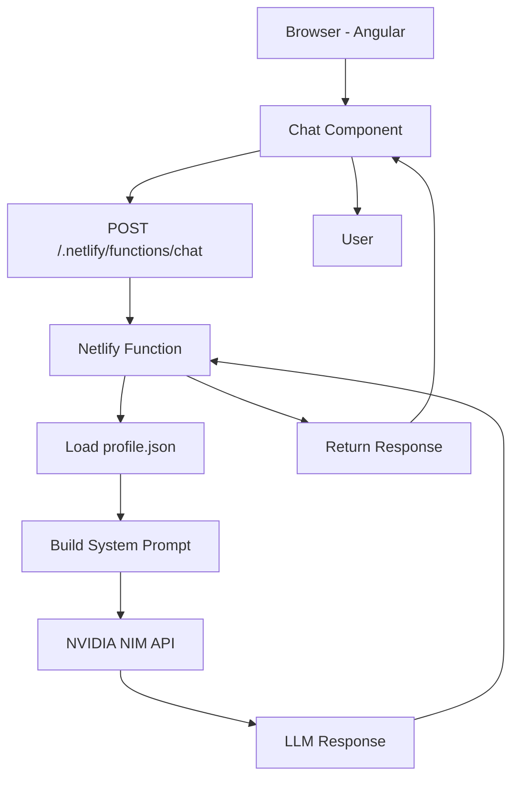

# Architecture

## Overview

The AI Portfolio Assistant follows a serverless architecture that keeps API credentials secure while providing a fast and responsive user experience.

The frontend is responsible only for the user interface. All communication with the AI model is handled through a Netlify Function, ensuring that sensitive credentials remain protected.

---

## Request Flow

---

## Components

### Angular Frontend

Responsibilities:

- Display the chat interface.
- Maintain conversation history.
- Show loading and typing indicators.
- Display suggested questions.
- Send user messages to the backend.
- Render AI responses.

---

### Netlify Function

Responsibilities:

- Receive requests from the frontend.
- Validate user input.
- Load the assistant context from `profile.json`.
- Build the system prompt.
- Call the NVIDIA NIM API.
- Return the generated response.
- Handle errors securely.
- Protect API credentials.

---

### NVIDIA NIM

Responsibilities:

- Process natural language requests.
- Generate responses using the provided context.
- Follow the system prompt restrictions.

---

## Knowledge Source

The assistant uses a structured `profile.json` file as its single source of truth.

The file contains information such as:

- Personal information
- Professional summary
- Work experience
- Projects
- Skills
- Education
- Languages
- Contact information

The AI must answer using only this information.

---

## Security

- API keys are stored as Netlify Environment Variables.
- API keys are never exposed to the frontend.
- All AI requests go through the Netlify Function.
- User input is validated before calling the AI provider.
- The assistant refuses questions unrelated to the portfolio.
- The assistant does not fabricate information.

---

## Design Decisions

| Decision | Reason |
|----------|--------|
| Angular | Existing frontend framework and component-based architecture. |
| Netlify Functions | Serverless backend with zero infrastructure management. |
| NVIDIA NIM | Access to high-quality open-source language models with a generous free tier for development. |
| profile.json | Simple, maintainable, and version-controlled knowledge source. |
| Serverless Architecture | Improves scalability, security, and deployment simplicity. |

---

## Future Improvements

- Retrieval-Augmented Generation (RAG)
- Vector database
- Embeddings
- Streaming responses
- Conversation memory
- Multi-language support
- Analytics dashboard
- Recruiter feedback system